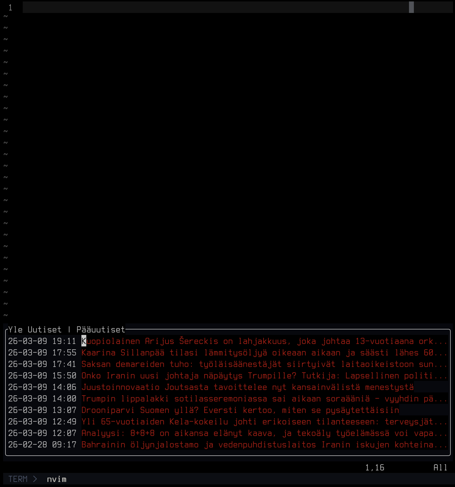

# quicknews.nvim

A plugin to show a quick popup window of most recent RSS feed items. A nifty tool if you want stay up to date with the most recent news of your choice.

## Install

```nvim
vim.pack.add { "https://github.com/jwayston/quicknews.nvim" }

require("quicknews").setup({
    rss = "https://yle.fi/rss/uutiset/paauutiset",
})

vim.keymap.set("n", "<leader>nn", ":QuickNews<CR>", { silent = true })

```

In addition to `rss`, you can set
- `height` to change popup window height (default 10)
- `title` if you don't like the RSS channel title
- `max_items` to limit how many news items are shown (default 10). 0 stands for no limits

## Usage

Listed items are markdown links and can be easily opened with `<C-x>` for example. `q` is window's internal key binding and closes it.



